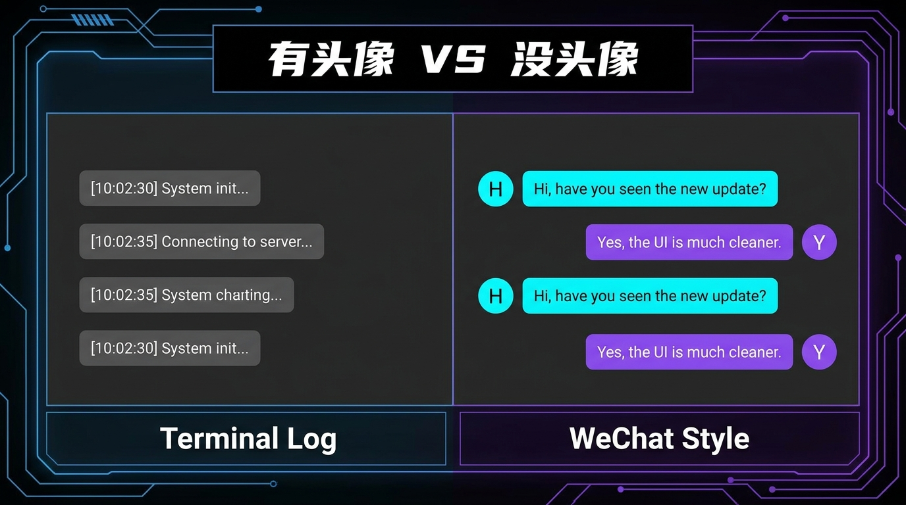
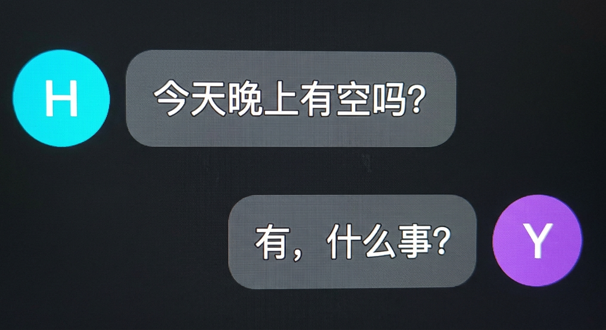

# Hermes Desktop Message Avatars 🎭

给 Hermes Agent 桌面版对话界面加上圆形消息头像——微信/飞书风格的气泡布局。

## 效果预览

- 👤 用户消息靠右，头像在右
- 🤖 Hermes 消息靠左，头像在左
- 🏷️ hover 显示名称标签
- 🖱️ 点击头像弹窗编辑（改名 / 换图）

## 安装

朋友对 Hermes 说**下面这一句话**就行：

> 用 hermes skills install https://github.com/WeilaiSun/hermes-desktop-avatars 安装桌面头像 skill，然后按 SKILL.md 的安装步骤执行，完事后提醒我重启桌面
